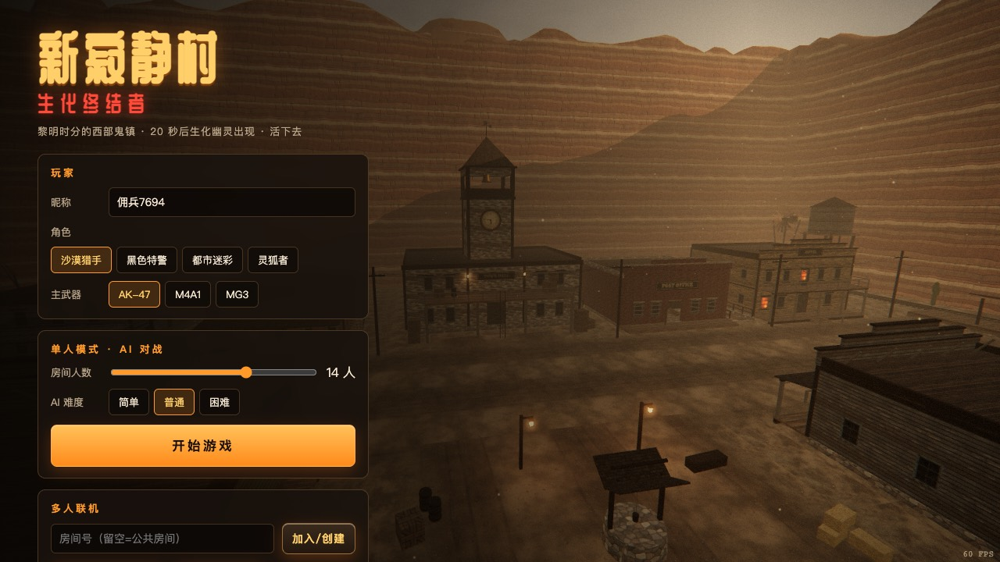
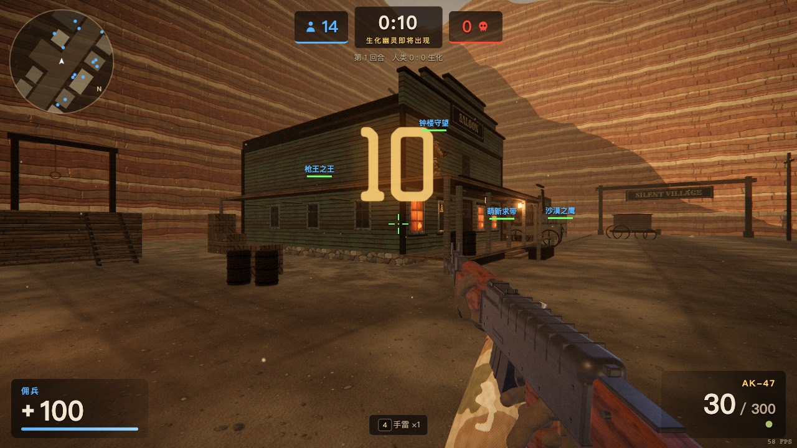
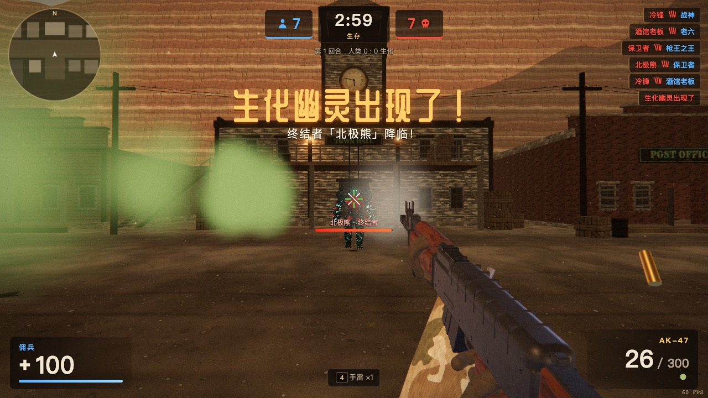
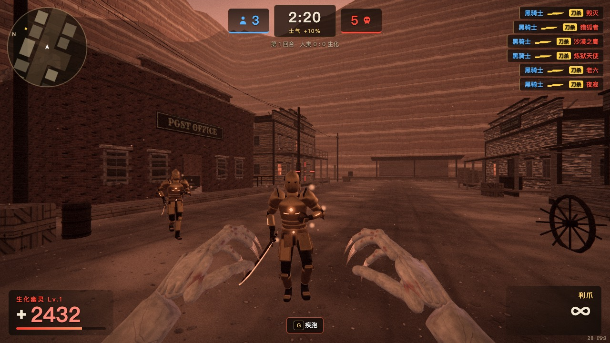
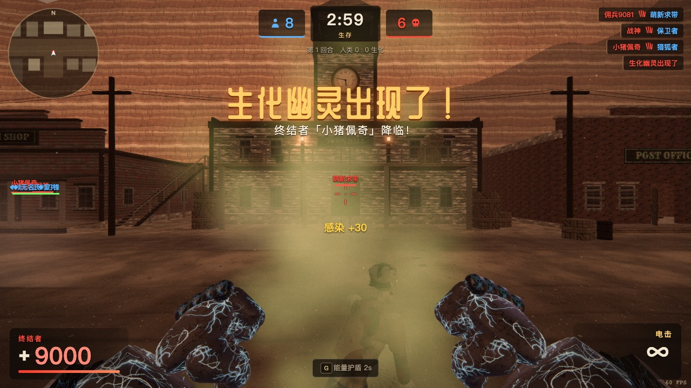
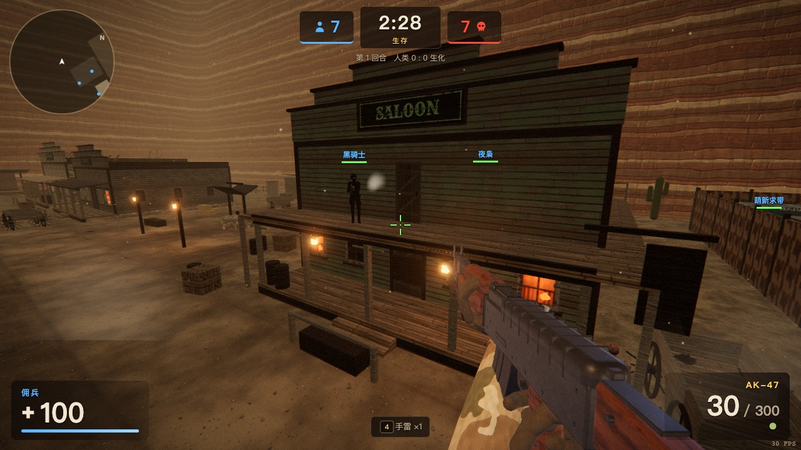
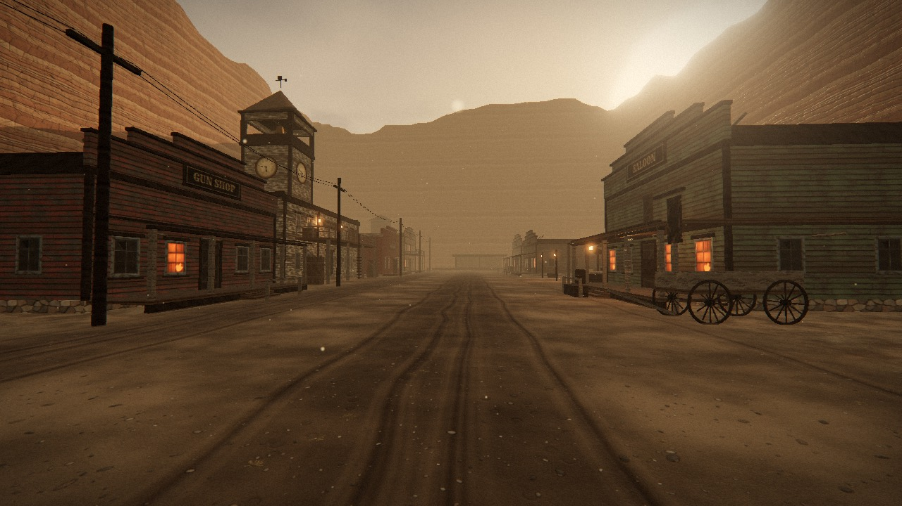
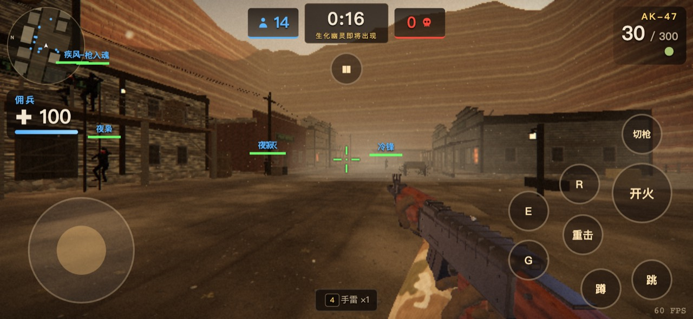

# 新寂静村 · 生化终结者 (Silent Village — Terminator Mode)

A browser-based 3D multiplayer zombie shooter — a fan recreation of the CrossFire (穿越火线) map
**New Silent Village / 新寂静村** (a.k.a. *Dawn Village*) played in the **Terminator (终结者) mutation mode**.

Everything — buildings, characters, weapons, textures, sound effects — is generated procedurally in code
(three.js + Web Audio). No external game assets are used.

**▶ Play: https://cfterminator.leftzzzz.top** (mirror: https://silent-village-zombie.leftzzzz666.workers.dev) (desktop keyboard + mouse recommended; touch controls on phones)

| | |
|---|---|
|  |  |
|  |  |
|  |  |
|  |  |

## Features

- **The map**: a Western ghost town at dawn in a canyon — gloomy amber sky, dust, tumbleweeds, a clock tower
  with a working bell. All classic holding spots:
  蓝房子屋顶 (Blue House roof, tricky parkour) · 枪店 (Gun Shop, stairway to the roof + back ledge) ·
  钟楼平台 (Clock-tower platform, ladder-only) · 钟楼屋顶 · 酒馆窄台 (Saloon ring ledge — watch the sign corner) ·
  邮局 (barricaded Post Office room) · 地下通道 (Underpass with two entrances) · 仓库 (Storage yard with containers,
  open container in the corner) · boxcar at the railway station.
- **Terminator mode rules**: 20 s countdown → mother zombies + one **Terminator** (终结者) mutate; zombies infect
  on hit; zombies respawn unless killed with a knife; evolve after 3 / 5 infections; Terminator energy shield (G)
  and x-ray vision of humans; the last ~20% of humans can press **E** to become **Ghost Hunters** (幽灵猎手) with a
  heavy energy blade (knife/blade kills are permanent); morale +10% when ≤3 humans remain; supply drops; CF-style knockback on zombies.
- **Weapons**: AK-47, M4A1, MG3, Desert Eagle, M9 knife (light/heavy), HE grenades — recoil, spread, reloads,
  tracers, decals, headshots.
- **AI bots** fill the room: human bots path to real holding spots (auto-generated multi-level nav graph with
  jump/drop/ladder links) and defend; zombie bots hunt with a flow field; bots transform into hunters, use skills.
- **Online multiplayer** via Cloudflare Durable Objects: rooms, room list, invite links (`?room=xxx`).
  The host runs the rules + bots; other players join the same round. Host migration when the host leaves
  or backgrounds the tab.
- **Touch controls** on phones/tablets, adaptive resolution on slower GPUs.

## Controls

`WASD` move · `Space` jump · `Ctrl`/`C` crouch (crouch mid-air = crouch-jump onto ledges) · `Shift` walk ·
`LMB` fire / light attack · `RMB` heavy attack · `R` reload · `1-4` weapons · `Q` last weapon · `B` choose primary ·
`G` skill (zombie sprint / Terminator shield / grenade) · `E` become Ghost Hunter · `Tab` scoreboard ·
`Enter` chat · `V` third person · `Esc` menu

## Development

```bash
npm install
npm run dev          # vite dev server (single-player works; multiplayer needs the worker)
npm run cf:dev       # build + wrangler dev (static assets + Durable Object rooms)
npm run deploy       # build + deploy to Cloudflare Workers
```

Project layout:

```
src/world/      map layout (map.js), geometry builder, materials
src/engine/     renderer (sky, post-processing), procedural textures, audio synthesis, effects
src/entities/   procedural animated character models
src/weapons/    procedural weapon models + first-person viewmodel
src/game/       actors, physics (capsule vs octree), nav graph, bots, Terminator mode rules, game loop
src/ui/         HUD
src/net/        WebSocket client
worker/         Cloudflare Worker + Durable Objects (Room relay, Lobby)
```

## Disclaimer

Non-commercial fan project. CrossFire / 穿越火线 is a trademark of Smilegate / Tencent; this project is not
affiliated with or endorsed by them. All content here is original procedural work.
